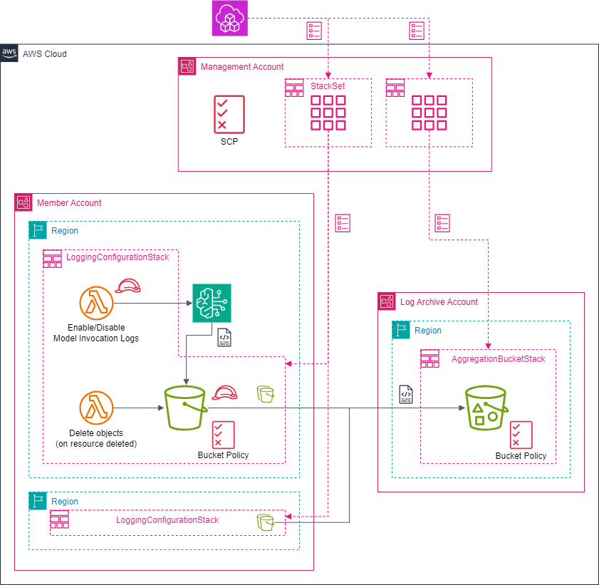

# AWS CDK + StackSets による Organization 下の Bedrock モデル実行ログ有効化

## アーキテクチャ図



## 前提条件

- AWS CDK (TypeScript) の実行環境
- サービスマネージド型の CloudFormation StackSets 実行権限

## 使い方

### デプロイ

1. `cdk/bin/map.example.ts` を同ディレクトリへ別名でコピーし、ファイル名を map.ts に変更してください。

2. 行コメントを参考に map.ts の各プロパティを適切な値へ置き換えてください。

3. `cdk` ディレクトリ以下で下記コマンドを実行してください。envName は map.ts の envNamePropsMapping で設定した適切なキー名に置き換えてください。

- ログ集約 S3 バケット作成 (初回及び Bedrock モデル実行ログ有効化リージョン追加時)

```bash
cdk deploy BedrockModelInvocationLoggingSharedResourceStackSets --context envName=Management
```

- Bedrock モデル実行ログ有効化

```bash
cdk deploy BedrockModelInvocationLoggingConfigurationStackSets --context envName=Management
```

### クリーンアップ

```bash
cdk destroy --all --context envName=Management
```

必要であれば

- ログ集約アカウントの S3 バケット (バケット名: `[resourcePrefix]-agg-[アカウント ID]-[リージョン名]`) を手動で削除してください。

- Bedrock モデル実行ログ有効化アカウントにある ロググループ名が `/aws/lambda/[resourcePrefix]` から始まる CloudWatch Logs LogGroup を削除してください。
